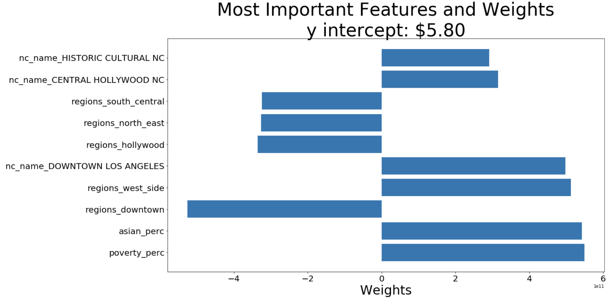

# Capstone_project

## Introduction:

Back in early 2012, The Los Angeles Fire Department admitted to the [Los Angeles Times](https://latimesblogs.latimes.com/lanow/2012/03/la-fire-department-admits-exaggerating-response-times.html) that they exaggerated the data to make it appear that firefighters were responding to emergencies quicker than they actually were. The false data reported that in 2008 the department responded to emergencies within five minutes about 86 percent of the time. It turns out the LAFD categorized 6 minute responses the same as 5 minute responses. Apparently the corrected data showed that the department actually met the five-minute benchmark only 64 percent of the time in 2008. In the LA Times report mentioned above, it mentions the "Federal guidelines call for first responders to arrive on scene in under five minutes 90% of the time."

Response times can sometimes be a factor in the difference between life and death. There have been times when a person has died while waiting for the medical help to arrive. Reducing the wait time should be the top priority for the LAFD and the City officials; nevertheless in recent years, the response time seems to have increased. Through this project we hope to discover if certain regions in LA play any factor in the response time from the LAFD. 

The findings in this project can be utilized by LA County residents, who can now have a better understanding on LAFD's potential response time in their neighborhood council region based on certain factors. The City of LA can also use this to determine what areas/factors need evaluation and/or improvement:
    * Idle ambulances can be put back into service
    * Upgrade of technical equipment
    * More efficient system for fire-fighters to response to calls requiring full PPE & fire-use equipments
 

*We also want to end on the note that we have great appreciation to the dedication and
commitment of all emergency responders in the Los Angeles County and we simply hope that this report can be of some use for the improvement of their service to all residents in LA.*  

## Problem Statement:

We will use two datas from the Los Angeles City [website](https://data.lacity.org/A-Safe-City/All-Stations-Response-Metrics/kszm-sdw4), LAFD's response metric and Census Data of Los Angeles neighborhoods, in order to explore the emergency metrics and census data for the LA neighborhood councils. The main objectives for this project are listed as follows:

**1) We want to analyze if certain locations (N.Cs/ regions) within the Los Angeles County has any affect on the time it takes for the LAFD respondents to arrive at the scene. In this project we strive to investigate whether certain factors such as, the poverty rate, majority ethnic group, or the region of a location in LA has any correlation to the average response time from the LAFD.**

**2) We will build a regression model to predict the response time of the LAFD when it comes to EMS reports given certain information from a particular location in the County of Los Angeles. Model performance will be guided by RMSE and the model test score.** 
 
 
 
### Dataset Collection:

LA CITY has available a variety of datasets. The 2 main sets we will use throughout the project are the LAFD Response Metric Raw Data and the Census Data by N.C. The data dictionary pdf can be found in the website below under "attachment"

[Source](https://data.lacity.org/A-Safe-City/LAFD-Response-Metrics-Raw-Data/n44u-wxe4)
* LAFD Response Metrics - Raw Data
    - Data last updated in April 8, 2019
    
[Source](https://data.lacity.org/A-Safe-City/All-Stations-Response-Metrics/kszm-sdw4)
* Archived response Time metrics for all LAFD stations
    - Contains all stations response metrics from 2011 to 2017
    
[Source](https://data.lacity.org/A-Safe-City/Fire-Stations/sfzi-8n8k)
* LA County Fire Station locations (geo-spatial data)
    - Data last updated in November 2016
    
[Source](https://data.lacity.org/A-Livable-and-Sustainable-City/Census-Data-by-Neighborhood-Council/nwj3-ufba)
* Census 2010 population/demographic data approximated from block groups to 97 LA Neighborhood Councils
    - Data last updated in April 2018

[Source](https://data.lacity.org/A-Well-Run-City/Neighborhood-Councils-Certified-/fu65-dz2f)
* Neighborhood Councils -Certified (geo-spatial data)
    - Official Certified Neighborhood Council boundaries in the City of Los Angeles created and maintained by the Bureau of Engineering /       GIS Mapping Division.
    - Data last updated in November 2017

The LAFD response metric raw data contains 4.7 million rows of LAFD incident reports. We collected 4 million rows of data as a JSON file and then converted into a Panda DataFrame with the help of Socrata. 

## Predicting Models

At this stage, we utilized the data in order to create a model that can best predict the response time of the LAFD respondents using the census metrics and a few LAFD Response metrics.

These are the columns we selected as potential features that may impact the response time of the LAFD respondents to an emergency call in  a particular region of the LA County.

| Features |  Data Type  |  Description |
| ---   |  ---   |  ---        |
| **dispatch_status** | **Object** | The status of the responding unit at the time of dispatch. For example, status “QTR” means a unit responded from quarters, “RAD” means a unit responded from a radio call in and was not in quarters at the time, “AVI” means the unit is available, typically when released from an incident, and “ONS” means the unit is on-scene. |
| **first_in_district** | **Int** | The location where the incident occurred in terms of a Fire Station district. The area where a particular fire station responds as well as where the incident occurred. |
| **ppe_level** | **Object** | EMS category includes incident types that require minimum PPE* and a Turnout Time of 60 seconds. The majority of these incidents are medical in nature and do not require fire suppression tools and equipment to mediate. The NON-EMS category includes incidents that require full PPE* and a Turnout Time of 80 seconds. The majority of these incidents require fire suppression tools and equipment to mediate and may result in patients that require medical evaluation and treatment. *Personal Protective Equipment* |
| **unit_type** | **Object** | The type of responding unit. |
| **total_pop** | **Float** | Total population of residents in the neighborhood councils |
| **nc_name** | **Object** | Los Angeles County Neighborhood Councils |
| **call_process_time** | **Int** | The time interval that starts when the call is created in CAD by a Fire Dispatcher until the initial Fire or EMS3 unit is dispatched |
| **turnout_time** | **Int** | The time interval between the activation of station alerting devices to when the first responders put on their PPE4 and are aboard apparatus and en-route (wheels rolling).  Both station alarm and en-route times are required to measure this for each unit that responds.  Turnout time is calculated for each unit dispatched to each incident |
| **response_time** | **Int** | The time interval that begins when the first Standard Unit is en-route to the incident and ends upon arrival of any of the Standard Units first on scene.  This requires one valid en-route time and one valid on-scene time for the incident.  Travel time can differ considerably amongst stations |
| **year** | **Int** | Year the incident was reported |
| **quarter** | **Object** | Quarter of the year the incident was reported |
| **regions** | **Object** | Region of the incident |
| **white_perc** | **Float** | White population percentage |
| **black_perc** | **Float** | Black population percentage |
| **asian_perc** | **Float** | Asian population percentage |
| **hawn_pi_perc** | **Float** | Hawaiian population percentage |
| **other_perc** | **Float** | Other population percentage |
| **multi_perc** | **Float** | Multi population percentage |
| **poverty_perc** | **Float** | Poverty population percentage |
| **owner_occ_perc** | **Float** | Owner occupants population percentage |
| **renter_occ_perc** | **Float** | Renter occupants population percentage |

All models will be scored according to the RMSE and Model scores (R2). RMSE and R2 scores the model performance by examining the magnitiude of the model's residual errors (the difference between the actual response time to the mean response time.

#### BASELINE ACCURACY:

**Root Mean Squared Error: 221.671 ; R2: 0.0**

Root Mean Squared Error: RMSE is 233.9, which is significant large given our dataset. This metric represents the average distance from the actual response time (seconds) to the mean (predicted response time in seconds). We need to minimize this score in order to have an accurate model.

R2 score: The baseline model does not explain any of the target data's variability around its' mean. The predictions are inaccurate. The goal is to increase the R2 score as close to 1 (100%) as possible so that the variability in the data can be explained by the model.

### Linear Regression Model:

Train R2 Score: 0.16100812885771
Test R2 Score: 0.15931963671763205

### Random Forest Regression Model: 

The Linear Regression model provided us a terrible accuracy score for predicting response times. We attempted to improve the accuracy by implementing the Random Forest Regression model using the same training and testing set.

Training Score: 0.609
Testing Score: 0.057

The training R2 score jumped significantly, somewhat expected from a Random Forest model. However the testing R2 score decreased even further suggesting extreme over-fitting.

### XGBoost Regressor Model:

Training Score: 0.188
Testing Score: 0.186
RMSE for XGBRegressor: 0.434

## Conclusion & Limitations & Improvements:

Unfortunately the predictive models did not produce favorable results. Based on our analytics, there seems to not be enough signal in the datasets we collected. 

Our limitations transpired from the lack of assessible census data which forced us to make a variety of assumptions. One of the primary assumptions we had to make was that the 'first-in-district' column for each of the emergency response by the LAFD rows correspond to the fire-station department in our fire-station geo-spatial dataset. Assuming that it was correct, we also made an assumption that the fire-department that first responded to the incident, must be near the same geographic location as where the incident took place. Afterwards we created a plot displaying the boundaries of the 97 Neighborhood Councils throughout the LA County and matched the fire-station geographic locations that are within the boundaries of the N.C. 

We were able to merge datasets with inferring the first_in_district number corresponds to the Neighborhood Council.

Another huge limitation was that we underestimated how computationally expensive running the models would be. We will consider moving the processings to the Cloud via AWS in order to run the GridSearch of finding the best hyperparamters of our respective models. 